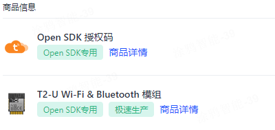

# tuya-open-sdk-for-device
[English](https://github.com/tuya/tuya-open-sdk-for-device/blob/master/README.md) | 简体中文

## 简介
tuya-open-sdk-for-device 是一款跨芯片平台、操作系统的 IoT 开发框架。它基于通用南向接口设计，支持 Bluetooth、Wi-Fi、Ethernet 等通信协议，提供了物联网开发的核心功能，包括配网，激活，控制，升级等；它具备强大的安全合规能力，包括设备认证、数据加密、通信加密等，满足全球各个国家和地区的数据合规需求。

基于 tuya-open-sdk-for-device 开发的 IoT 产品，如果使用 tuya_cloud_service 组件的功能，就可以使用涂鸦APP、云服务提供的强大生态能力，并与 Power By Tuya 设备互联互通。

同时 tuya-open-sdk-for-device 将不断拓展，提供更多云平台接入功能，及语音、视频、人脸识别等功能。

## 开始体验

### 安装依赖
Ubuntu and Debian

```sh
$ sudo apt-get install lcov cmake-curses-gui build-essential wget git python3 python3-pip python3-venv libc6-i386 libsystemd-dev
```

### 克隆仓库

```sh
$ git clone https://github.com/tuya/tuya-open-sdk-for-device.git
$ git submodule update --init
```

## 设置与编译

### 设置环境变量
```sh
$ cd tuya-open-sdk-for-device
$ export PATH=$PATH:$PWD
```
或将 tuya-open-sdk-for-device 路径添加到系统环境变量中。

tuya-open-sdk-for-device 通过 tos 命令进行编译、调试等操作，tos 命令会根据环境变量中设置的路径查找 tuya-open-sdk-for-device 仓库，并执行对应操作。

tos 命令的详细使用方法，请参考 [tos 命令](./docs/zh/tos_guide.md)。

### 配置
### menuconfig 配置 
选择需配置的 examples 或 apps 对应工程，在对应工程目录下运行如下命令进行菜单化配置：
```sh
$ cd examples/get-started/sample_project
$ tos menuconfig
```
配置当前工程，配置完成后保存退出，编译工程。

### 编译
选择当前编译的 examples 或 apps 对应工程，运行如下命令编译：
```shell
$ cd examples/get-started/sample_project
$ tos build
```
编译完成后目标文件位于 `examples/get-started/sample_project/.build/t2/bin/t2_1.0.0` 目录。

项目版本默认为 `1.0.0`，可在 menuconfig 配置中修改。

## 多平台配置
tos 工具通过项目工程目录下的 project_build.ini 文件配置多平台编译，配置文件格式如下：
```ini
[project:switch_demo_t2]
platform = t2

[project:switch_demo_t3]
platform = t3
```

默认 project 只有 1 个，如需编译多个 project，需在 project_build.ini 文件中添加多个 project 配置。

当配置文件中存在多个 project 时，`tos build` 命令会依次编译多个 project。

### 支持 platform 列表
| 名称 |  |
| ---- | ---- |
| Ubuntu | 可在 ubuntu 等 Linux 主机上直接运行 |
| t2 | [https://developer.tuya.com/cn/docs/iot/T2-U-module-datasheet?id=Kce1tncb80ldq](https://developer.tuya.com/cn/docs/iot/T2-U-module-datasheet?id=Kce1tncb80ldq) |
| t3 | [https://developer.tuya.com/cn/docs/iot/T3-U-Module-Datasheet?id=Kdd4pzscwf0il](https://developer.tuya.com/cn/docs/iot/T3-U-Module-Datasheet?id=Kdd4pzscwf0il) |
|


## 示例工程
tuya-open-sdk-for-device 提供了丰富的示例工程，方便开发者快速上手，了解 tuya-open-sdk-for-device 的使用。

```shell
$ tuya-open-sdk-for-device
├── ai
│   └── llm_demo
├── ble
│   ├── ble_central
│   └── ble_peripher
├── get-started
│   └── sample_project
├── peripherals
│   ├── adc
│   ├── gpio
│   ├── i2c
│   ├── pwm
│   ├── spi
│   ├── timer
│   └── watchdog
├── protocols
│   ├── http_client
│   ├── mqtt
│   ├── tcp_client
│   └── tcp_server
├── system
│   ├── os_event
│   ├── os_kv
│   ├── os_mutex
│   ├── os_queue
│   ├── os_semaphore
│   ├── os_sw_timer
│   └── os_thread
└── wifi
    ├── ap
    ├── low_power
    ├── scan
    └── sta
```

每个示例工程下对应有 README.md 文件，详细介绍了示例工程的配置、编译、运行等操作。

## 涂鸦云应用
涂鸦云应用是涂鸦 IoT 平台提供的一种应用，通过涂鸦云应用，开发者可以快速实现设备远程控制、设备管理等功能。

`switch_demo` 演示一个简单的，跨平台、跨系统、支持多种连接的开关示例，通过涂鸦 APP、涂鸦云服务，可以对这个开关进行远程控制。

1. 创建产品并获取产品的 PID：

参考文档 [https://developer.tuya.com/cn/docs/iot-device-dev/application-creation?id=Kbxw7ket3aujc](https://developer.tuya.com/cn/docs/iot-device-dev/application-creation?id=Kbxw7ket3aujc) 在 [https://iot.tuya.com](https://iot.tuya.com) 下创建产品，并获取到创建产品的 PID 。

然后替换 `apps/tuya_cloud/switch_demo/src/tuya_config.h` 文件中 `TUYA_PRODUCT_KEY` 宏分别对应 pid。

2. 确认涂鸦云授权码：
tuya-open-sdk-for-device 采用 tuya-open-sdk-for-device 专用授权码，使用其他授权码无法正常连接涂鸦云。

```shell
[switch_demo.c:220] Replace the TUYA_DEVICE_UUID and TUYA_DEVICE_AUTHKEY contents, otherwise the demo cannot work
[switch_demo.c:222] uuid uuidxxxxxxxxxxxxxxxx, authkey keyxxxxxxxxxxxxxxxxxxxxxxxxxxxxx
```

可通过以下方式获取 tuya-open-sdk-for-device 专用授权码：

- 方式1：购买已烧录 tuya-open-sdk-for-device 授权码模块。该授权码已经在出厂时烧录在对应模组中，且不会丢失。tuya-open-sdk-for-device 在启动时通过 `tuya_iot_license_read()` 接口读取授权码。请确认当前设备是否为烧录了 tuya-open-sdk-for-device 授权码。

- 方式2：如当前模组未烧录 tuya-open-sdk-for-device 授权码，可通过 [https://platform.tuya.com/purchase/index?type=6](https://platform.tuya.com/purchase/index?type=6) 页面购买 **Open SDK 授权码**，并在以下代码中将 `TUYA_DEVICE_UUID` 和 `TUYA_DEVICE_AUTHKEY` 替换为购买成功后获取到的 uuid 和 authkey。



```c
    tuya_iot_license_t license;

    if (OPRT_OK != tuya_iot_license_read(&license)) {
        license.uuid = TUYA_DEVICE_UUID;
        license.authkey = TUYA_DEVICE_AUTHKEY;
        PR_WARN("Replace the TUYA_DEVICE_UUID and TUYA_DEVICE_AUTHKEY contents, otherwise the demo cannot work");
    }
```

> 如 `tuya_iot_license_read()` 接口返回 OPRT_OK，则表示当前设备已经烧录了 tuya-open-sdk-for-device 授权码，否则表示当前模组并未烧录 tuya-open-sdk-for-device 授权码。

## FAQ
1. tuya-open-sdk-for-device 支持的 platform 通过子仓库动态下载，更新 tuya-open-sdk-for-device 仓库不会主动更新子仓库，如遇到问题无法正常编译，请至 platform 文件夹下对应的目录下使用 `git pull` 命令更新，或删除 platform 文件夹下对应目录后再次下载。

2. 通过二维码扫码激活需产品 PID 支持 “设备直连云” 功能，否则激活会报错，导致无法正常激活。


## License
本项目的分发遵循 Apache License 版本 2.0。有关更多信息，请参见 LICENSE 文件。

## 贡献代码
如果您对 tuya-open-sdk-for-device 感兴趣，并希望参与 tuya-open-sdk-for-device 的开发并成为代码贡献者，请先参阅 [贡献指南](./docs/zh/contribute_guide.md)。

## 免责与责任条款

用户应明确知晓，本项目可能包含由第三方开发的子模块（submodules），这些子模块可能独立于本项目进行更新。鉴于这些子模块的更新频率不受控制，本项目无法确保这些子模块始终为最新版本。因此，用户在使用本项目时，若遇到与子模块相关的问题，建议自行根据需要进行更新或于本项目提交问题（issue）。

若用户决定将本项目用于商业目的，应充分认识到其中可能涉及的功能性和安全性风险。在此情况下，用户应对产品的所有功能性和安全性问题承担全部责任，应进行全面的功能和安全测试，以确保其满足特定的商业需求。本公司不对因用户使用本项目或其子模块而造成的任何直接、间接、特殊、偶然或惩罚性损害承担责任。
